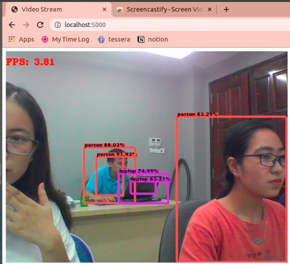

# Simple COMPUTER VISION with Demo

### Overview

This project contains 2 simple computer vision tasks and live demo

1. [Object Detection](https://github.com/Kimtuthap97/simple-computer-vision-demo/tree/master/yolov3-webcam)
1. [Teachable-Machine](https://github.com/Kimtuthap97/simple-computer-vision-demo/tree/master/teachable-machine)

---

##### Checklist

**Object Detection**

- [x] Object Detection (Yolov3)
- [x] Live Web Demo (from webcam)
- [ ] Instruction for Pretrained model

**Teachable Machine**
- [ ] Features Extraction from Resnet 
- [ ] Simple Classification
- [ ] Web Demo

---

##### Requirements

[Updating]

##### Getting Started

Cloning this project is the first thing you need to do
```
git clone https://github.com/Kimtuthap97/simple-computer-vision-demo.git
```

1. **Object Detection**

	Following the guideline in [Object Detection](https://github.com/Kimtuthap97/simple-computer-vision-demo/tree/master/yolov3-webcam) if you like to create a live-webcam demo

	
1. **Teachable-Machine**

	Or following this [Teachable-Machine](https://github.com/Kimtuthap97/simple-computer-vision-demo/tree/master/teachable-machine) if you'd love to see how to teach a computer recognize simple objects.

### Acknowledgement

This project was made during my internship at [KidsCode](https://www.kidscode.edu.vn). Thanks for **x** and **y**.