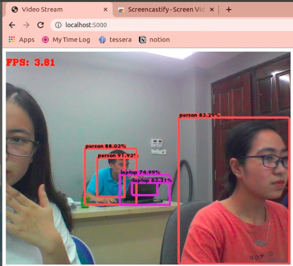

# Simple Object Detection with YoloV3

### Overview

This project aims to create a Live Demo for Object Detection via web-cam.\

---

#### Checklist

**Object Detection**

- [x] Object Detection (Yolov3)
- [x] Live Web Demo (from webcam)
- [ ] Instruction for Pretrained model

---

##### Requirements

[Updating]

#### Getting Started

Cloning this project is the first thing you need to do
```
git clone https://github.com/Kimtuthap97/simple-computer-vision-demo.git
```
[Updating due to requiremnets file is missing]

```
cd yolov3-webcam
python web.py
```
Okie, open any web brower, open http://0.0.0.0:5000. You could see your live camera with object detection here.

Expected result should be like this



### Update Log

- **29/05/2020**: Init (•‾⌣‾•)و ̑̑♡
- **30/05/2020**: Deleted `requirements.txt` due to vulnerabilities warning 

### References

Object Detection (YoloV3) API is heavily borrowed from [theAIGuysCode](https://github.com/theAIGuysCode/Object-Detection-API)